  

  
  
  
  
  
  

# 🏢 Awesome Membership Management

> **Curated list of the best membership management software** — SaaS platforms & open-source GitHub projects focused on **association management**, **member portals**, **dues & renewals**, **community engagement**, and **nonprofit CRM**.

> 📊 **Market Size:** The global membership management software market is valued at **~$5.9B (2026)** and projected to reach **$8.4B by 2034** (CAGR ~4.5%, Straits Research). The core association management software (AMS) segment is at **~$2.7–3.0B (2026)**, growing to **$4.4B by 2031** (CAGR ~10.3%, Mordor Intelligence). The market is **moderately fragmented** — no single vendor holds >10% market share. Consolidation is driven by private equity roll-ups (Momentive Software, Daxko, Community Brands) rather than organic winner-take-all dynamics, with heavy vertical specialization across nonprofits, fitness, professional associations, and community groups.

This repository tracks notable **SaaS platforms** and **open-source projects** for membership management. These tools help **associations, clubs, nonprofits, gyms, makerspaces**, and member-based organizations manage member databases, recurring dues, event registrations, communications, and community engagement.

Examples include WildApricot, Join It, MemberPress, MemberPlanet, MemberNova, Glue Up, ClubExpress, Zen Planner, PushPress, MemberClicks, Raklet, VeryConnect, Hivebrite, Member365, Neon CRM, and YourMembership (the category leaders).

🔓 **Open-source emphasis:** This list is heavily expanded with every major active project for self-hosting, custom member workflows, and transparent data ownership — ideal for associations, cooperatives, makerspaces, and developers building member-centric platforms.

✨ **Contributions welcome!** Open a PR to add/update entries. Keep descriptions factual and link to official sites.

---

## 📋 Table of Contents

- [🏢 SaaS / Hosted Platforms](#-saas--hosted-platforms)
- [🛠️ Open-Source GitHub Projects](#️-open-source-github-projects)
- [💡 Additional Open-Source Options & Frameworks](#-additional-open-source-options--frameworks)
- [🤝 How to Contribute](#-how-to-contribute)
- [❤️ Support](#️-support)
- [📈 Star History](#-star-history)
- [⚠️ Disclaimer](#️-disclaimer)

---

## 🏢 SaaS / Hosted Platforms

> Sorted by company size (revenue / valuation) in descending order. Pricing and free tier details are based on publicly available information as of September 2026.

| Product | Description | 💰 Starting Price | 🆓 Free Tier / Trial Limits | 📏 Company Size (Est.) |
| :--- | :--- | :--- | :--- | :--- |
| **[Personify](https://personifycorp.com)** | Enterprise AMS (ThreeSixty) for large associations, YMCAs, and JCCs with configurable workflows | $30,000–$80,000+/yr (enterprise quote) | No free tier; enterprise scoping demo only | ~$37–50M ARR; **Momentive Software ~$2.0B** |
| **[WildApricot](https://www.wildapricot.com)** | All-in-one membership management for small nonprofits and associations with website builder & email marketing | $66/mo (100 contacts); $59.40/mo annual | Free plan: 50 contacts, 1 admin, basic website, no online payments; **60-day free trial** | Personify subsidiary; **Momentive Software ~$2.0B** |
| **[Aptify](https://www.communitybrands.com/products/aptify/)** | Enterprise-grade membership management for large, complex organizations with configurable data structures | $25,000–$50,000/yr; TCO $100K–$350K+ | No free tier; enterprise scoping demo only | ~$10–30M ARR; **Momentive Software ~$2.0B** |
| **[MemberClicks](https://www.memberclicks.com)** | Member engagement and renewal management CRM for professional and trade associations | $3,500/yr (~$292/mo) for MC Trade | No free tier; guided sales demo only | ~$15.2M pre-acq. ARR; **Momentive Software ~$2.0B** |
| **[YourMembership](https://www.yourmembership.com)** | Association management software with member portal, career center, and community features | $3,990/yr (~$333/mo); scales to $10K–$20K/yr | No free tier; guided demo only | ~$4.6M ARR; **Momentive Software ~$2.0B** |
| **[Zen Planner](https://www.zenplanner.com)** | Membership management and billing for fitness studios, gyms, and martial arts | $99/mo (0–45 active members); scales to $289+/mo (251+) | No free tier; no standard self-serve trial; live demo required | ~$4.3–6.8M ARR; **Daxko parent ~$1B+** |
| **[Hivebrite](https://hivebrite.com)** | Community management and membership platform for alumni networks, associations, and organizations | $895/mo (Core Plan, billed annually at $10,740/yr) | No free tier; no free trial; enterprise demo only | ~$17–22M ARR; **$148M valuation** (Series B) |
| **[ClubExpress](https://www.clubexpress.com)** | Membership management software for clubs and associations with website, event, and payment tools | $24/mo min ($0.40/member/mo for first 100); $150 setup | **60-day trial**: max 8 members, 8 non-members; no live payments during trial | ~$25M ARR; **~$82M valuation** (Lumaverse/Providence Equity) |
| **[PushPress](https://www.pushpress.com)** | Gym management platform with membership billing, access control, and member engagement tools | $0/mo (Core Free); $159/mo (Pro); $229/mo (Max) | **Free forever**: unlimited members, scheduling, billing, check-ins; CC fee 4.99%+$0.30; **7-day Pro trial** | ~$15M ARR; **$32.6M total funding** |
| **[Billhighway](https://www.billhighway.co)** | Chapter management software for multi-chapter organizations with performance data and engagement tools | 0.90%–2.00% of invoice volume (custom per-member fee) | No free tier; enterprise consultation/demo only | **~$11–23M revenue** (re:Members/Lovell Minnick) |
| **[MemberPlanet](https://www.memberplanet.com)** | Membership management and payment processing for groups, clubs, and associations | $0/mo (Basic); $50/mo Essentials; $40/mo annual | **Free forever**: unlimited members & admins; 100 emails/mo; 4.0%+$0.30 txn fee | **~$21M ARR**; $2.5M seed funding |
| **[Neon CRM](https://www.neonone.com)** | Nonprofit CRM with membership management, donations, event management, and relationship tracking | $99/mo (Essentials); +10% for Memberships module (~$109/mo) | No free tier; demo upon request only | **~$20M ARR** (Neon One; FTV Capital backed) |
| **[Glue Up](https://www.glueup.com)** | Complete engagement management platform for associations and chambers of commerce | ~$250/mo ($3,000–$6,500/yr, billed annually) | No free tier; no free trial; 1-on-1 demo only | **~$14.1M ARR**; $10M total funding |
| **[MemberPress](https://memberpress.com)** | WordPress membership plugin for creating paid content, courses, and community access with recurring subs | $199.50/yr 1st yr (~$17/mo); renews $399/yr; 4.9% txn fee on Launch | No free tier; **14-day money-back guarantee** | **~$5–15M ARR** (Caseproof/Awesome Motive) |
| **[VeryConnect](https://www.veryconnect.com)** | Membership and community management software with member portals and networking features | £160/mo (~$210/mo) or £3,000/yr for Membership Lite | No free tier; no free trial; discovery demo only | ~$2.5M ARR; **~$7.6M valuation** |
| **[MemberNova](https://www.membernova.com)** | Data-driven association CRM with member engagement, renewal, and retention analytics | $250/mo (quote-based contracts) | **14–30 day trial** sandbox upon request | **~$1.5M ARR** (ClubRunner; private, Canada) |
| **[TidyHQ](https://www.tidyhq.com)** | Association management for clubs, nonprofits, and community groups with memberships, events, and payments | $0/mo (Free Starter); $69/mo (Pro); $690/yr annual | **Free forever**: unlimited contacts; 100 emails/mo; 500MB storage; 2 apps; 30-day history; **30-day Pro trial** | **~$1.4M ARR** (~13 employees; Melbourne, AU) |
| **[Member365](https://member365.com)** | Membership management with CRM, event, and communication tools for associations | $299/mo base + one-time setup fee | **30-day free trial**: core CRM, events, email marketing, store | **~$1.1M ARR**; $1.38M funding (Ottawa, CA) |
| **[Raklet](https://raklet.com)** | Membership management and community platform for associations, clubs, and nonprofits | $0/mo (Free); $49/mo Essentials (annual); $59/mo monthly | **Free forever**: 100 contacts, 1 admin, 1,250 emails/mo; 4%+$0.60 txn fee; **14-day paid plan trial** | **~$1M ARR**; Techstars seed ~$120K |
| **[SilkStart](https://www.silkstart.com)** | Membership management and CRM built for associations and nonprofits | $241/mo (annual, up to 500 members); $252/mo monthly; setup fee applies | **15-day free trial** sandbox with setup assistance | **~$0.7M ARR** (acquired by Metasoft 2018) |
| **[Join It](https://www.joinit.com)** | Simple membership management platform focused on integrations and ease of use | $29/mo; $26.10/mo annual + 3.0% platform txn fee | **30-day free trial**: full features, no credit card required | **~$290K revenue** (~2–10 employees) |

---

## 🛠️ Open-Source GitHub Projects

> Sorted by ⭐ GitHub Stars_Count (descending). Stars_Badges link to each repository's stargazers page. This section covers association management systems, membership portals, gym/fitness software, makerspace access control, WordPress membership plugins, and subscription billing platforms.

| Project | Description | License |
| :--- | :--- | :--- |
| [**Dolibarr**](https://github.com/Dolibarr/dolibarr)  | Open-source ERP/CRM with a dedicated **Members module** for managing members, subscriptions, and dues. Widely used by associations and small organizations. PHP/MySQL. | GPL-3.0 |
| [**Kill Bill**](https://github.com/killbill/killbill)  | Enterprise open-source **subscription billing** and payment platform for handling complex recurring membership dues, automated dunning, and invoicing. Java. | Apache-2.0 |
| [**ESP-RFID**](https://github.com/esprfid/esp-rfid)  | Open-source **physical access control** firmware for ESP8266/ESP8285 — widely deployed by makerspaces, hackerspaces, and clubs to validate active member RFID keycards at doors and machines. C++. | MIT |
| [**ChurchCRM**](https://github.com/ChurchCRM/CRM)  | Open-source **church and congregation management** with complete member tracking, family grouping, member portals, pledge/donation management, and volunteer coordination. PHP/MySQL. | MIT |
| [**CiviCRM**](https://github.com/civicrm/civicrm-core)  | Industry-standard open-source **CRM/AMS for nonprofits** and associations — manages member directories, dues, renewals, events, and advocacy campaigns. PHP/MySQL. | AGPL-3.0 |
| [**OpenSlides**](https://github.com/OpenSlides/OpenSlides)  | Open-source **digital assembly and meeting management** for associations, unions, and parties — member roll calls, delegate credentials, agenda management, and certified voting. Python/Angular. | MIT |
| [**Tendenci**](https://github.com/tendenci/tendenci)  | The first fully open-source **Association Management System (AMS)** — built for nonprofits and associations with membership management, event registration, donations, payments, newsletters, and a CMS. Python/Django. | GPL-3.0 |
| [**Paid Memberships Pro**](https://github.com/strangerstudios/paid-memberships-pro)  | Premier open-source **WordPress membership plugin** to restrict content access, configure unlimited membership levels, and process recurring subscription dues via major gateways. PHP/WordPress. | GPL-2.0 |
| [**Gymie**](https://github.com/lubusIN/gymie)  | Laravel-based **gym and fitness club management** for tracking gym member records, recurring memberships, attendance, subscription fees, and automated SMS/email reminders. PHP/Laravel. | MIT |
| [**Admidio**](https://github.com/Admidio/admidio)  | Open-source **user and membership management** for clubs, associations, and volunteer organizations — custom member profile fields, role-based groups, event management, and dues tracking. PHP. | GPL-3.0 |
| [**Fab-Manager**](https://github.com/sleede/fab-manager)  | Open-source management software for **FabLabs, makerspaces, and hackerspaces** — user memberships, machine reservations, equipment training credentials, and project documentation. Ruby/TypeScript. | AGPL-3.0 |
| [**Ultimate Member**](https://github.com/ultimatemember/ultimatemember)  | Open-source **WordPress member portal** plugin — frontend user profiles, searchable member directories, custom registration forms, and role-based content restrictions. PHP/WordPress. | GPL-2.0+ |
| [**GYM One**](https://github.com/mayerbalintdev/GYM-One)  | Open-source **gym management web software** for fitness clubs, trainers, and studios to manage member profiles, check-ins, passes, and class scheduling. PHP/MySQL. | Open Source |
| [**MemberMatters**](https://github.com/membermatters/MemberMatters)  | Open-source **membership, billing, and access control** for makerspaces and community groups — Stripe recurring payments, RFID access control, kiosk mode, and SSO support. Python/Vue.js. | MIT |
| [**Galette**](https://github.com/galette/galette)  | Membership management web application for **nonprofit organizations** — manages members, dues, contributions, and email communications with a clean PHP interface. PHP. | GPL-3.0 |
| [**Arooo**](https://github.com/doubleunion/arooo)  | Ruby on Rails **membership management app** for makerspaces and hackerspaces — member applications, key management, onboarding workflows, and monthly dues. Ruby on Rails. | GPL-3.0 |
| [**OpenJVerein**](https://github.com/openjverein/jverein)  | Open-source **club and association administration** (Vereinsverwaltung) — member databases, subscription categories, attendance tracking, and SEPA direct debit banking for dues collection. Java. | GPL-3.0 |
| [**Bitrix24**](https://github.com/bitrix24/b24ui)  | Business platform with CRM, member management, and social network features (self-hosted version). **Note:** Core platform is proprietary; only SDKs and docs are on GitHub. Used by 12M+ organizations. | Proprietary (SDKs: MIT) |
| [**Socius**](https://github.com/rufusinfabula/Socius)  | Self-hosted **association management system** installable like WordPress — member registry, renewals, PayPal/Satispay payments, events, assemblies, and minutes. PHP 8.1+/MySQL. | GPL-3.0 |
| [**Member Console**](https://git.coopcloud.tech/wiki-cafe/member-console) | Open-source software for offering **hosted services on a paid membership** — identity, entitlements, billing (Stripe), and service provisioning. Built in Go with PostgreSQL and Temporal. *(Hosted on Co-op Cloud Gitea, not GitHub)* | AGPL-3.0 |

---

## 💡 Additional Open-Source Options & Frameworks

> 🧩 **Build your own stack** — Combine these open-source tools for transparent, self-hosted membership platforms:

- **🏛️ CRM/AMS Frameworks:** Combine [Dolibarr](https://github.com/Dolibarr/dolibarr) or [Tendenci](https://github.com/tendenci/tendenci) with [Nextcloud](https://github.com/nextcloud/server) for file sharing and [Listmonk](https://github.com/knadh/listmonk) for newsletters.
- **💳 Payment Processing:** [Stripe](https://stripe.com) and [PayPal](https://www.paypal.com) open-source integrations for membership billing. [Kill Bill](https://github.com/killbill/killbill) for complex recurring billing.
- **💬 Community Platforms:** [Discourse](https://github.com/discourse/discourse) (forum), [Mattermost](https://github.com/mattermost/mattermost) (chat), and [HumHub](https://github.com/humhub/humhub) (social network) for member engagement.
- **🎫 Event Management:** [Pretix](https://github.com/pretix/pretix) and [Eventyay](https://github.com/fossasia/eventyay) for ticketed member events.
- **🔐 Access Control:** [ESP-RFID](https://github.com/esprfid/esp-rfid) for physical door/machine access; [MemberMatters](https://github.com/membermatters/MemberMatters) for integrated makerspace access.
- **📊 Analytics & Reporting:** [Grafana](https://github.com/grafana/grafana) for transparent, self-hosted membership dashboards.
- **🧱 Full-Stack Examples:** Combine Tendenci + Galette + Dolibarr + Stripe + PostgreSQL + Grafana for transparent, self-hosted membership platforms.

---

## 🤝 How to Contribute

1. 🍴 Fork the repo.
2. ✏️ Add/edit entries in `README.md` (follow existing format).
3. 📝 Include: name, link, 1–2 sentence description, and whether it's SaaS or open-source.
4. 🚀 Submit PR with a short explanation.
5. ⭐ Star the repo if you find it useful!

---

## ❤️ Support

Thank you for checking out **Awesome Membership Management**! 🙏

If you find this resource helpful, please consider:

- ⭐ **Starring** this repository to help others discover it
- 🍴 **Forking** it to contribute or customize for your needs
- 📢 **Sharing** it with your network — associations, nonprofits, developers, and community organizers
- 🐛 **Opening issues** to suggest new tools or report outdated information

If you'd like to support the maintainer's work on this and other open-source projects:

☕ **[Buy me a coffee → GitHub Sponsors Dashboard](https://github.com/sponsors/ishandutta2007)**

Every star, fork, share, and sponsorship helps keep this list up-to-date and growing. Thank you! 💜

---

## 📈 Star History

---

## ⚠️ Disclaimer

- This is a community-curated list — not exhaustive and not an endorsement.
- Membership management tools handle sensitive member data; ensure compliance with **GDPR**, **CCPA**, and relevant data protection regulations.
- Self-hosted open-source solutions require proper security hardening and regular maintenance.
- Pricing and free tier information is based on publicly available data and may change. Always verify on official product websites.

---

  Made with ❤️ for associations, clubs, cooperatives, nonprofits, and community organizers. 
  Let's make membership management more <strong>open, transparent, and member-centric</strong>. 🌍

